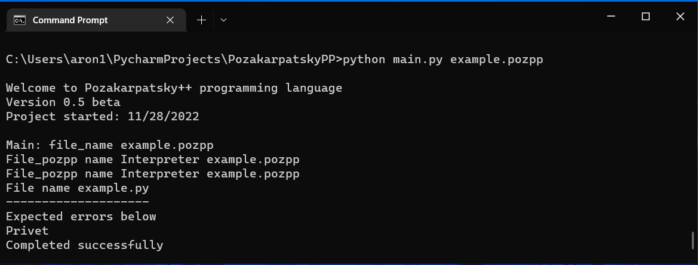

# Pozakarpatskiy++ Programming Language

# Version 0.1

* 11/29/2022 

# Version 0.3

* 12/09/2022

# Preparing for Version 0.5 --donestatus

* Implementation of [Run.py](https://github.com/Sciencewolf/pozpp_beta/blob/master/Run.py) ~~--almostdonestatus~~ --donestatus
* Trying to test the programming language ~~--triedstatus~~ --donestatus

### Testing
* Test 1. Trying to run [main.py](https://github.com/Sciencewolf/pozpp_beta/blob/master/main.py) --triedfailedstatus
* keywords is changed but without content example => defmainmainifprint
* output file [example.pozpp.py](https://github.com/Sciencewolf/pozpp_beta/blob/master/example.pozpp.py)
##### --------------------------------

* Test 2. Trying to run [main.py](https://github.com/Sciencewolf/pozpp_beta/blob/master/main.py)  --donestatus
* output file [example.py](https://github.com/Sciencewolf/pozpp_beta/blob/master/example.py)

# Version 0.5 beta
* 12/11/2022
#### Screenshot "First success run"

# Version 0.5
* 12/14/2022

## How to run pozpp program
> First, download this repository and write your first program
* Save file as [filename].pozpp

> Then, open your terminal in source code directory and type 
`python main.py [pozpp_filename]`

> For example 
`python main.py example.pozpp`

### Get help
`python main.py --help`

`python main.py -h`

# TO-DO (Fixing issues, etc.)
* ~~Issue with converting all pozpp keywords to py keywords **word-by-word method**~~ --donestatus
* Website 

# Our CodeEditor
* [CodeEditor](https://sciencewolf.github.io/CodeEditor/)